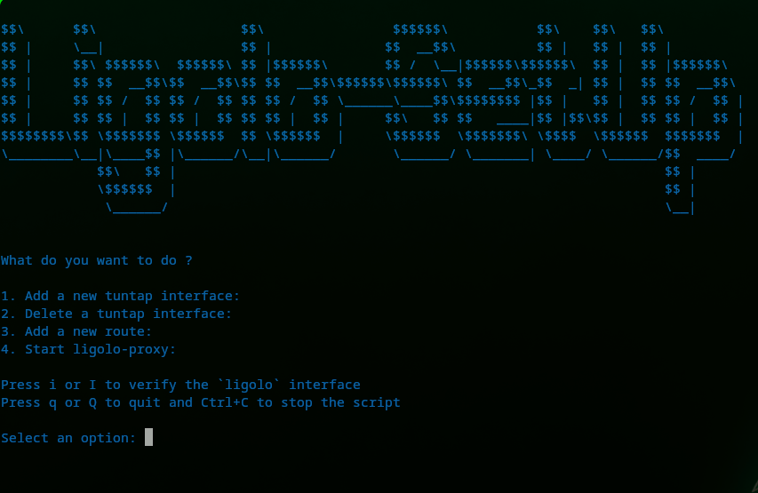

## Ligolo setup commands
I love ligolo and love using it. This small bash script helps me with running the initial setup for adding a new tuntap device on my OS.
It is easy to use and had to share it for me not to lose it again because I am lazy running these commands everytime I want to use ligolo.
It is straight forward and really easy to use.

### Requirement
The only requirement so far is to have root access or password to be able to make it work. If you are having issues running the commands you are proably missing `iproute` or `iproute2` package depending on your OS.

On Debian/Ubuntu-based distributions:
```
sudo apt update
sudo apt install iproute2
```
On Red Hat/CentOS/Fedora-based distributions:
```
sudo yum install iproute
```
or (on newer versions of Fedora):
```
sudo dnf install iproute
```
On Arch Linux:
```
sudo pacman -S iproute2
```
or 
```
yay -S iproute2
```
## Usage
Very easy to use, so that you don't have to type these everytime. You can add one or delete one. Your choice.
Once installed, give it executable permissions. Also make sure to have `ligolo-ng` installed and the proxy having the name `ligolo-proxy` in your PATH.
> Here is a link to the `ligolo-ng` [binaries](https://github.com/nicocha30/ligolo-ng/releases)

```bash
chmod +x ligolo-setup.sh
```
Once this step is done we are ready to roll, now just execute it and make a choice:
```bash
./ligolo-setup.sh
```
Here are some screenshots:



The script will ask you to choose an option and then it will do the job for you. But if you are having issues, just run the script again and it will ask you again. 

> P.S: I am not responsible for any damage or loss of data that might happen if you are using this script, which is doubt will ever will. Use it at your own risk. Always make sure that you added the `tuntap` interface and the route before starting the proxy. Otherwise, you might end up not being able to use the proxy or the script.

Hope it helps someone who is also tired of those commands or too much in a rush of typing those commands. 
Planning on adding functionalities as I go because `ligolo-ng` is such a powerfull tool and makes a lot of things easier regarding pivoting.

Keep hacking and enjoy 😄

## Improvements
@TODO
This is not its final form, it can always get better.
* [ ] Add a way to delete ligolo routes.
* [ ] Add a verification/confirmation of the route input.
* [ ] Do not start the `ligolo-proxy` without a new route on the interface.
* [ ] Make a video demo
